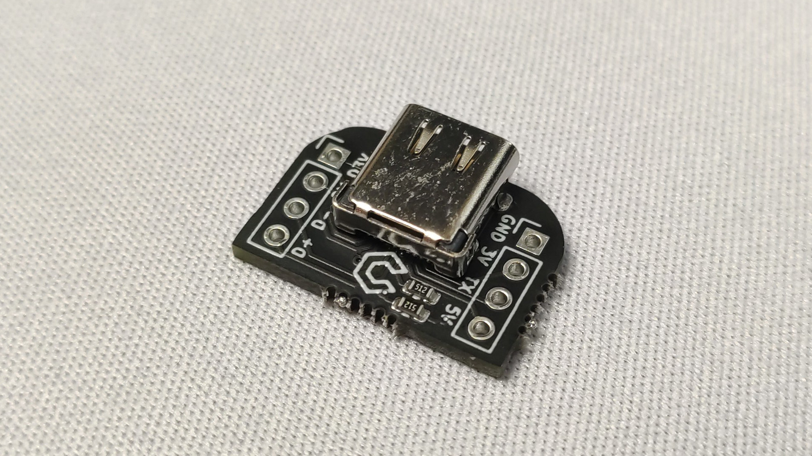
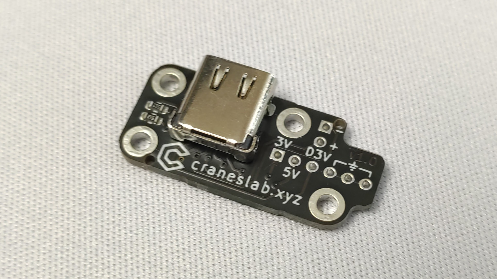

# Model-U

This is a circuit board for adding USB-C to custom controllers.

Currently there are two versions of this board. One that is shaped to mount onto other circuit boards, and another that is shaped to mount onto a GameCube controller motherboard.

### Type 1 - Model U

### Type 2 - Model U GCC

Both can be used with USBC-Gamecube cables and USBC-N64 cables that use the same pinout as the B0XX/Frame1.